> Bryan Jamieson
# Module 4 -  Time Series Analysis Project

## Introduction:
For this data analysis project, I have been hired as a consultant for a fictional real-estate investment firm. The firm wants to know:
> What are the top 5 best zip codes for us to invest in?

My goal is to forecast real estate prices of various zipcodes using data from Zillow and find the 5 "Best Investments" in The Greater Atlanta Area.

### Definition of "Best Investment"
#### "Best investment" = Zip code has the highest 10-year ROI & zipcode meets all 4 of our investment criteria.

### Opportunity:
As a Georgia native with an impressive 6 months of real estate experience, they couldn't have picked a better pro for the job.

Over the past 20 years I have lived in Atlanta, I have seen more and more people move away from downtown to the suburbs because the cost of living is much cheaper.

Everyday, 500 people move to Atlanta; therefore, the suburb begins to fill up very quickly. Prices begin to rise and the next suburb begins to develop. Suppose the first suburb was 30 min from downtown and the next suburb being developed is 40 minutes from the city. Prices will be more expensive in the closer suburb. But as suburbs are built farther and farther away, what one might have imagined as "far" today, could be PRIME REAL ESTATE in 10 years.

Good news for the investment firm, We have a MASSIVE opportunity to pinpoint the best zip codes in The Greater Atlanta Area to forecast where the PRIME REAL ESTATE will be in 10 years.

### Zillow Real Estate Data
Zillow Real Estate Data includes: Monthly median house prices from 4/1996 - 4/2018, city, state, county, zip code, sizerank, and Region ID.

I picked 3 counties that I hypothesize real estate prices will rapidly increase over the next 10 years.

    1) Fulton County
    2) Dekalb County
    3) Cobb County

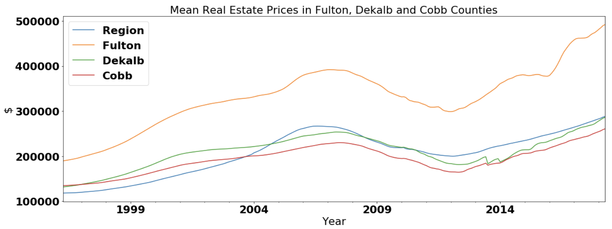

This graph makes a lot of sense. Fulton is the closest to Downtown Atlanta, then Dekalb, then Cobb.

I believe we have a massive opportunity to find a great investment in The Greater Atlanta Area, ideally, in the suburbs that are within 45 min of Downtown Atlanta. In order to figure out where the best zip codes are, we must filter the zip codes by our "Best ZIP Code Criteria"

## "Best ZIP Code Criteria":

1) Urbanization - Zip Code must be in top 50% according to sizerank variable.
** Traffic makes Commuting from the Greater Atlanta area into the city brutal ... So living within a 45min driving distance to work is essential.
** I hypothesize that the best investment opportunities will be found just outside the perimeter in growing suburbs.
    
2) Median House price
** House price should be close to the median house price for that zipcode, preferably lower.
** Range - 1.5 decile below and 1 decile above.

3) ROI (Return on investment)
** Investment Company wants to know which zipcodes will have the greatest 10 year ROI.

4) Risk
** Risk averse investment company. Zip codes to be selected according to a coefficient of variation below 70th percentile.

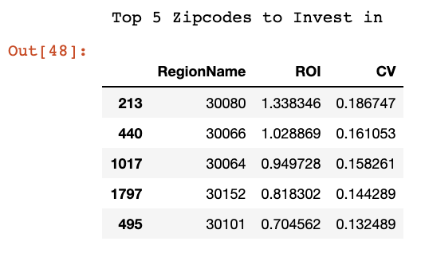

## Top 5 Zip codes

#### Zip code 30080 - Smyrna, GA
#### Zip code 30066 - Marietta, GA
#### Zip code 30064 - Marietta, GA
#### Zip code 30152 - Kennesaw, GA 
#### Zip code 30101 - Acworth, GA

NW Atlanta Zips (Cobb + Marietta GA)

## Time Series Analysis
#### Time Series Plot for our Top5 Zip codes

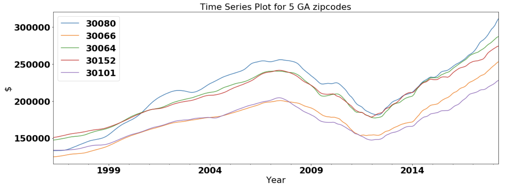

- I can see an overall positive trend year to year, but I am going to look at the returns by month to see if the trend is more stationary. 

- Note: The 2007 housing bubble crash is easily seen in our graph. So monthly returns are probably a better indicator.

#### Monthly Returns
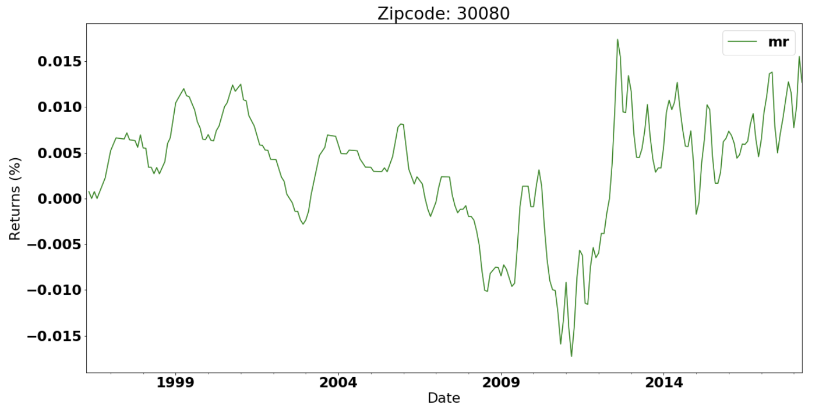

- No trend in data. Assumption - data is stationary

#### Rolling Mean
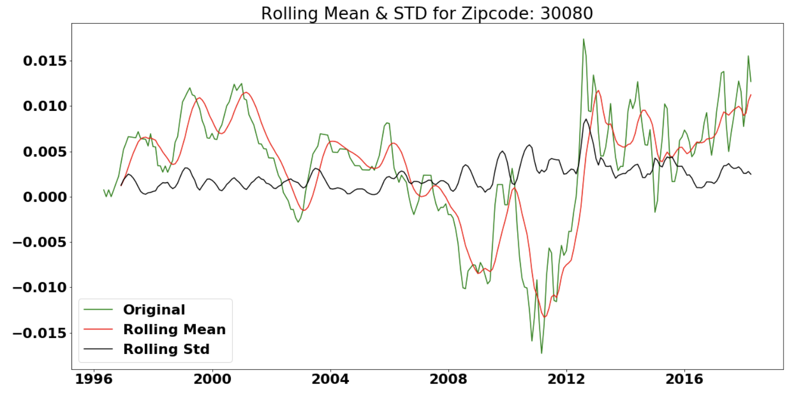

- After plotting rolling mean, rolling standard deviation, and monthly returns, there is no trend in the plot.
- Now I conducted an Augmented Dickey-Fuller Test for stationarity.

#### ADF (Augmented Dickey-Fuller Test)
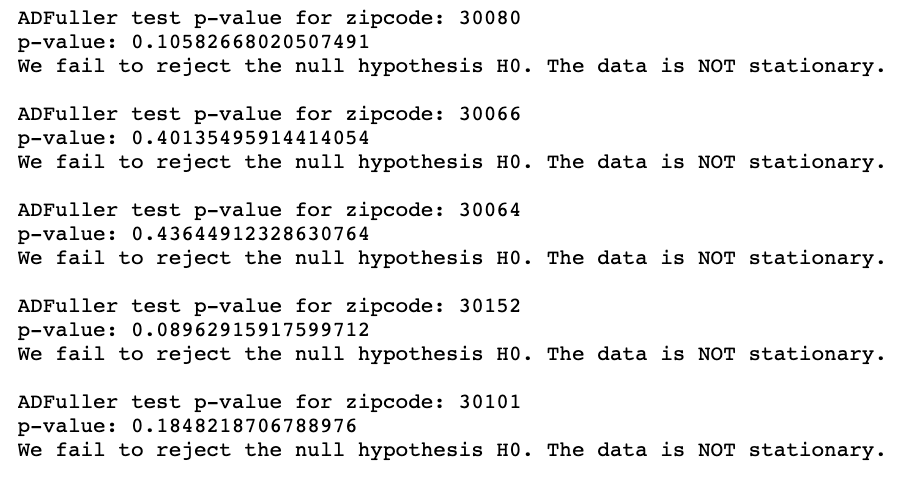

Insight:

a) Naked eye test tells us that the data looks stationary, but the Dickey-Fuller Test says the data is not stationary.
b) "i" is most likely 1 since all 5 zip codes were not stationary
c) If the data was stationary, "i" would have been 0

#### Differencing to make data stationary by removing trends and seasonality.
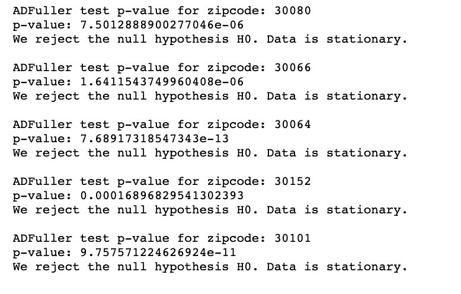

## ARIMA Modeling

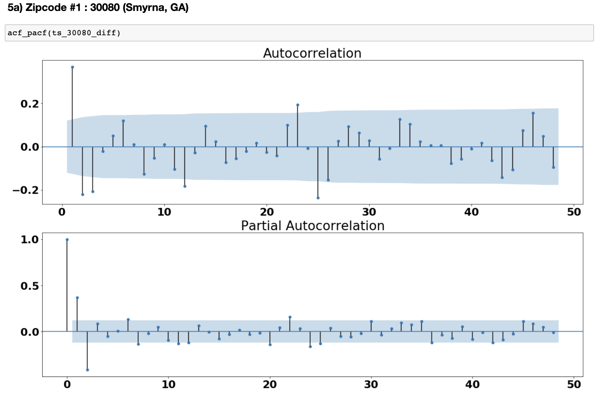

## SARIMA

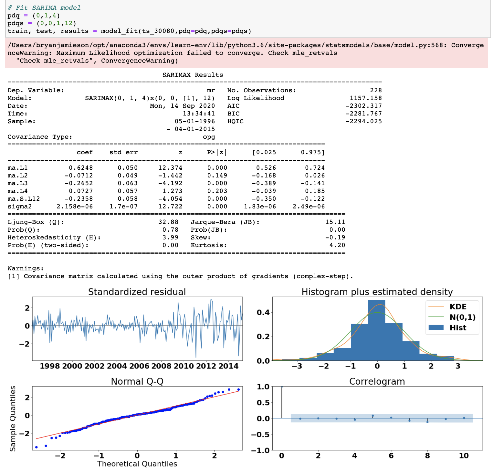

Train
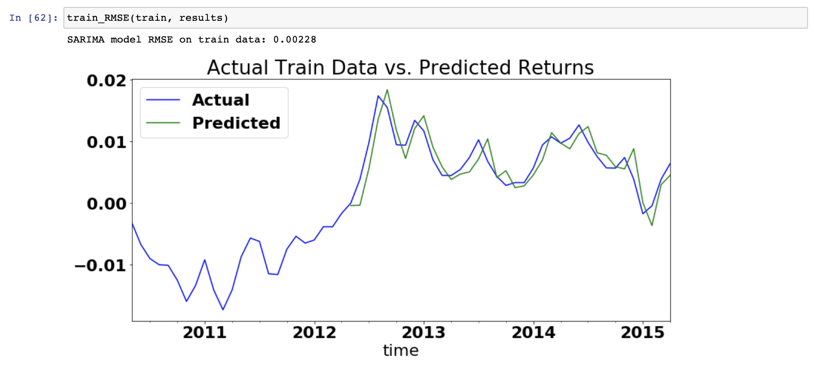

Test
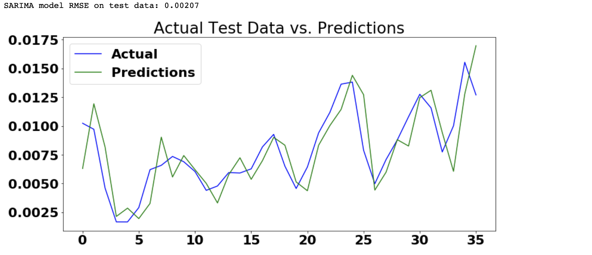
    ** Both predictions are very close to the actual data. RMSE are very close to each other.
    
#### Forcast the 1,3,5,10 year ROI for each zipcode

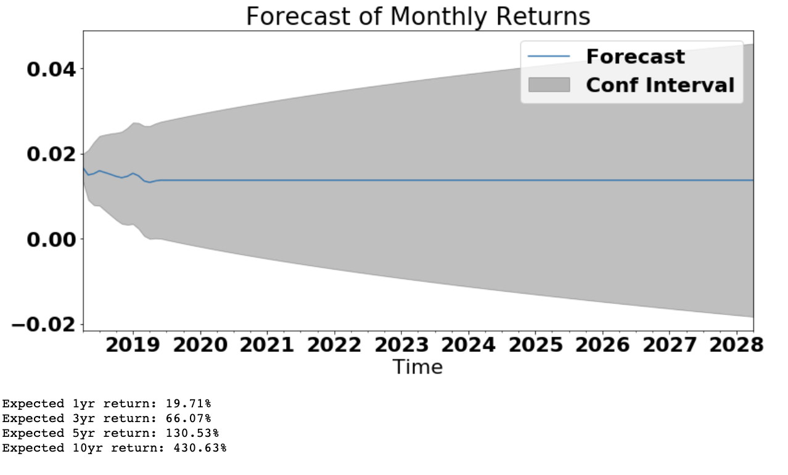

#### Results
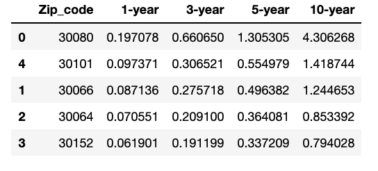

## Business Recommendations

#### After performing time series analysis on the top 5 zip codes in the Greater Atlanta Area, I recommend investing in 3:

#### 1) 30080 (Smyrna, GA) -> 10-yr return = 430.62%
#### 2) 30101 (Acworth, GA) -> 10-yr return = 141.87%
#### 3) 30066 (Marietta, GA) -> 10-yr return = 124.46%

#### The predicted return on investment for zip code 30080 is much higher than the other, look in Smyrna, GA first.

## Future Work

* Include 2019 and 2020 data
* Include impact of COVID-19 on real estate prices
* Change "Best Zip code" definition
* Change risk averse criteria to a very risky criteria 

Project After Thoughts

At first, I did not believe that my 430.62% 10-year prediction for zip code 30080 was correct. I began reading articles about investing in the atlanta suburbs and to my surprise, everyone of my top 5 zip codes appeared in these articles (check them out below)

https://blog.offerpad.com/13-of-the-hottest-zip-codes-to-buy-a-house-in-atlanta/
https://www.barringtonhomebuyers.com/blog/where-atlanta-investors-buy-houses/

I was also shocked to learn that 500 people move to Atlanta everyday. I knew it was a big city but that rate is unsustainable. The traffic is already horrendous, so I cannot imagine in 10 years what it will be like. One article stated, “There is a projection of 1.5 million new jobs to be created by 2040.  Atlanta is predicted to grow 38.7% by 2030, adding 1.4 million residents.” This is great and all, but the city is not ready for it.

Lastly, I wanted to note one factor I did not think of in my analysis until I finished. The 30080 zip code (430.62% 10-yr prediction), will rise even more in value because the new home of the Atlanta Braves, Truist Park, is located in Cobb county very close to this zip code. If anything, this will help increase home values in Cobb county.
